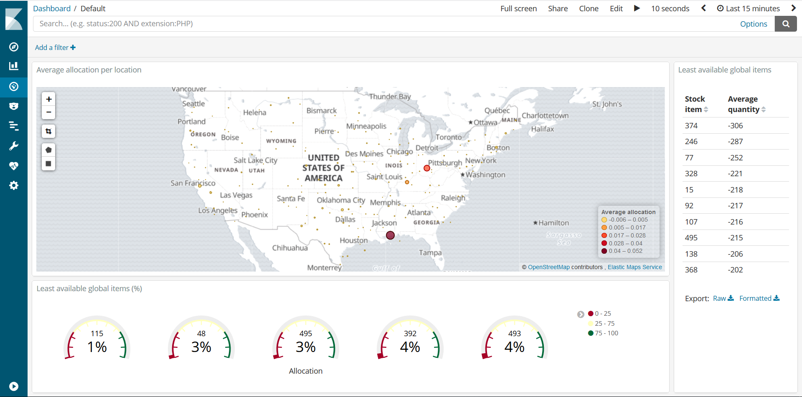

This is a sample end-to-end stream processing pipeline. It aggregates fake inventory data available on a postgres database to generate global inventory position and interesting information like warehouse capacity allocation. Aggregated data is sent to Elasticsearch and visualized using Kibana dashboards. All stream processing happens inside Apache Kafka and data is moved in and out of the Kafka cluster using Kafka Connectors.

The image below shows a live dashboard that is updated as inventory data is streamed into elasticsearch:



The top visualization gives a logistic view of overall warehouse capacity by showing relative allocation on a map. Each dot on the map would be a warehouse and relative allocation is updated as item quantities fluctuates (both up and down).

The visualization on the bottom shows the least available items as the % between current stock and the historical maximum (e.g. an item with 10 units and a historical maximum of 1000 units will show as 1%). The number on top of the percent is the fake product id. 

The last visualization shows products with low global quantity, but with no regards to historical values like the previous visualization had.

The image below shows the entire data pipeline:



## Running locally

To run you'll need Docker and Python 3 (not really required, but strongly recommended since it automates a lot of steps).

First you'll need to export the `DOCKER_HOST_IP` environment variable. As mentioned in [wurstmeister/kafka-docker](https://github.com/wurstmeister/kafka-docker) (the Kafka image used on this repo) one cannot assign it to `localhost` or `127.0.0.1`, but you can use the ip you got from any network you're connected to. If your docker runs inside a VM, `DOCKER_HOST_IP` should be the VM's ip.

Finally, run the `run.py` Python script. So in the end, do:

```bash
$ export DOCKER_HOST_IP=192.168.99.100
$ python3 run.py
```

The script will:

1. Build all docker images
2. Start the docker compose services (including the inventory generator and the Kafka Streams app)
3. Create the elasticsearch index templates
4. Create the Kafka Connectors on distributed mode
5. Create Kibana objects (index patterns, visualizations and the dashboard)

And it'll take a while to execute. When it's done, navigate to `http://$DOCKER_HOST_IP:5601`, follow Kibana's instructions to select a default index pattern (any will do) and then go to the dashboard on the side menu.

## Project layout

* `connect`: Contains the Dockerfile for [Kafka Connect](https://kafka.apache.org/documentation/#connectapi). Based on [wurstmeister/kafka-docker](https://github.com/wurstmeister/kafka-docker), but I made a few changes to enable connector configuration using environment variables.
* `consumer-producer`: a small app I used to understand Kafka's consumer and producer APIs. _Not_ part of the docker compose file. For further details check its README and code.
* `elasticsearch`: contains the JSON for the index templates, kibana objects and a helper script to create the templates. The python script will use those JSONs, but will ignore the bash script.
* `inventory-generator`: Java 11 application that generates random inventory data and inserts it into postgres. Part of the compose file. For further details check its README and code.
* `kafka`: Kafka image (forked from [wurstmeister/kafka-docker](https://github.com/wurstmeister/kafka-docker)).
* `kafka-streams-app`: Java 11 [Kafka Streams](https://kafka.apache.org/documentation/streams/) application that does all the stream processing. Part of the compose file; for further details check its README and code.
* `ksql`: contains a [KSQL](https://www.confluent.io/product/ksql/) docker file and queries that will perform the same aggregations that the Kafka Streams application does. Part of the compose file, but not executed by the Python script at the moment.
* `postgres`: contains a postgres Dockerfile and the statements used to create the inventory tables after the container starts (taken care by the Dockerfile, not the Python script).